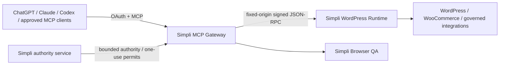

# Simpli WordPress MCP

First-party MCP control plane for Simpli Cosmetics Kenya.

The **public gateway source** has no direct Novamira or Novamira Pro endpoint/package dependency. Full WordPress-backend independence is a later acceptance gate and is **not yet claimed**.

## Current architecture



The public MCP/OAuth surface is owned by Simpli. WordPress is a bounded execution backend, not the public authorization server.

The gateway calls the Simpli-owned WordPress backend at:

```text
/wp-json/simpli-mcp/v1/mcp
```

using MCP-style `tools/list` and `tools/call` JSON-RPC operations. The WordPress origin and route are fixed in configuration and cannot be selected by an MCP caller.

## v3 migration status

The v3 program is staged so production remains recoverable while the gateway becomes independently governed.

### Phase 1 — foundation

`v3-foundation-novamira-free` established:

- one canonical runtime release identity across MCP metadata, `/`, `/health`, `/ready`, logs, and `/version`;
- a gateway-source regression check preventing direct Novamira endpoint/package dependencies in `src/`;
- first-party architecture, security, acceptance and migration records;
- explicit evidence grading: gateway independence is proven while WordPress-backend independence remains unverified.

### Phase 2 — protocol modernization

`v3-protocol-mcp-v2` moved the gateway to the stable MCP TypeScript SDK v2 split packages:

```text
@modelcontextprotocol/server 2.0.0
@modelcontextprotocol/express 2.0.0
@modelcontextprotocol/node 2.0.0
```

The public HTTP MCP endpoint uses `createMcpHandler` per request rather than an in-memory server-side MCP session map. It explicitly supports the 2026-07-28 protocol path while retaining the SDK's stateless legacy fallback for older 2025-era clients.

### Phase 3 — durable OAuth state

`v3-oauth-durable` replaced self-contained shared-secret OAuth grants and process-memory replay state with durable opaque-token state:

- Node 24 runtime with built-in SQLite;
- persistent clients, authorization-code state, access-token state, refresh-token families and revocations;
- raw authorization codes/access tokens/refresh tokens are never stored — only SHA-256 hashes are persisted;
- authorization-code replay prevention survives process restart;
- refresh tokens rotate on every successful refresh;
- reuse of a rotated refresh token revokes the entire token family;
- access-token and client revocation take effect durably;
- omitted OAuth scope defaults to `wordpress:read`;
- production requires an absolute persistent `OAUTH_STATE_DB_PATH`;
- `/ready` includes OAuth state health.

Because the authorization server and MCP resource server are co-located, opaque high-entropy bearer tokens are intentionally used instead of adding JWT/JWKS machinery that does not improve this trust boundary.

### Phase 4 — signed WordPress transport

`v3-signed-wordpress-runtime` introduces the `simpli-wp-request-v1` machine-transport contract.

The gateway signs the exact outbound request with Ed25519 and binds:

```text
HTTP method
fixed route
WordPress audience/origin
key ID
issued-at / expires-at
one-use nonce
SHA-256 body digest
Simpli MCP release ID
```

The WordPress verifier:

- validates the exact body digest and Ed25519 signature;
- checks audience, short validity window and bounded clock skew;
- admits only configured public key IDs;
- persists nonce hashes and rejects replay in enforcement mode;
- supports overlapping public verifier keys for controlled key rotation;
- exposes verified-request state to a future first-party permission callback without treating machine identity as business authority.

The staged transport modes are:

```text
basic -> dual -> signed
```

`dual` retains the WordPress Application Password while adding the signature, allowing verification before credential retirement. Production must not jump directly to signed-only mode.

**Transport identity remains separate from execution authority.** A valid Ed25519 request signature does not authorize a price, stock, order, settings or other material mutation. Simpli's A3/A4/A5 authority/permit layer, capability policy, expected-before-state, idempotency and read-back verification remain separate gates. A6 remains blocked.

See [docs/PHASE4_SIGNED_RUNTIME.md](docs/PHASE4_SIGNED_RUNTIME.md).

## Release identity

`src/version.ts` is the canonical runtime release identity. The same version must be reported by:

- MCP server metadata;
- `GET /`;
- `GET /health`;
- `GET /ready` under `release`;
- `GET /version`.

Optional deployment metadata can be injected with:

```text
SIMPLI_MCP_RELEASE_ID
SIMPLI_MCP_GIT_SHA
SIMPLI_MCP_BUILD_TIMESTAMP
```

The Phase 4 candidate is identified as `3.0.0-rc.4` and explicitly reports the Ed25519 signed-transport contract while keeping:

```text
novamiraGatewayDependency: false
wordpressBackendIndependence: "unverified"
```

The second value must not be promoted until the backend passes the Novamira-disabled acceptance suite.

## Authentication and authority

The current v3 public OAuth path uses Authorization Code + PKCE with durable opaque tokens. OAuth scope controls broad client access; business/execution authority is a separate layer and must not be inferred from tool access.

Current broad scopes are:

| Scope | Purpose |
| --- | --- |
| `wordpress:read` | Read-only governed operations |
| `wordpress:write` | Normal bounded writes |
| `wordpress:dangerous` | High-impact compatibility operations requiring additional controls |

If the client omits `scope`, only `wordpress:read` is granted.

The intended mutation chain is:

```text
OAuth identity/scope
-> Simpli governance decision
-> exact authority / one-use permit where required
-> signed machine transport
-> WordPress capability policy
-> expected-before-state + idempotency
-> mutation
-> read-back verification
-> audit evidence
```

The live SuperComputer already has a sealed one-use WordPress authority/attestation model. Phase 4 must align with that authority service rather than create a second independent business-authority issuer in the public gateway.

## Capability model

The preferred stable public primitives are:

```text
simpli_catalog
simpli_describe
simpli_execute
```

Domain capabilities live behind the Simpli-owned backend. A capability becomes usable only after explicit admission and policy; installing another WordPress plugin must not automatically expose privileged MCP operations.

Normal MCP production must not expose arbitrary PHP, arbitrary WP-CLI, administrator-login generation, generic shell/root execution or unrestricted filesystem mutation.

## Safety rules

- Read current state before writes.
- Tool visibility is not business authority.
- Machine transport identity is not business authority.
- Reject writes when required authority, confirmation, before-state, schema or idempotency conditions are missing.
- Do not blindly retry an unknown write outcome; read current state first.
- Verify material writes by read-back before reporting completion.
- Keep output bounded and never log credentials, bearer tokens or private keys.
- Reject redirects from the fixed WordPress origin.
- Fail closed when policy/catalog/OAuth state/readiness is not proven.

## Health and diagnostics

| Endpoint | Meaning |
| --- | --- |
| `/health` | Process liveness and canonical runtime release identity |
| `/ready` | WordPress backend/catalog readiness plus OAuth-state health and canonical release identity |
| `/version` | Runtime deployment/release metadata and current independence evidence state |
| `/.well-known/oauth-protected-resource` | OAuth protected-resource discovery |
| `/.well-known/oauth-authorization-server` | Authorization-server metadata |
| `/oauth/revoke` | OAuth token revocation |
| `/mcp` | Dual-era per-request MCP endpoint |

A successful `/health` response alone does **not** prove OAuth persistence, WordPress execution readiness, signed-transport production acceptance, backend independence or real-client production acceptance.

## Local verification

Requirements: Node.js 24. Phase 4 cross-language verification also uses PHP 8.2+ with libsodium.

```bash
npm ci
npm run check
npm test
npm run build
```

Phase 4 CI additionally verifies:

- PHP syntax for the clean-room verifier;
- Node-to-PHP Ed25519 canonical-message interoperability;
- tampered-body rejection;
- signed and dual gateway transport behavior;
- Node 24 container build.

## Deployment safety

Production must not be switched from the current known-good release merely because an isolated branch builds.

Before a v3 cutover:

1. all applicable CI checks pass on the exact release head;
2. OAuth discovery and PKCE pass with real target clients;
3. the modern 2026-07-28 MCP path passes real-client acceptance where the client supports it;
4. the production OAuth database resides on verified persistent storage and restore/recovery has been tested;
5. `/ready` proves both OAuth state and the Simpli backend catalog are available;
6. Phase 4 reaches `dual + observe`, then `dual + enforce`, with positive and negative signed-request evidence;
7. signed-only WordPress permission handling is explicitly integrated and tested before Basic credentials are revoked;
8. representative reads match production truth;
9. a representative safe write passes read-before-write, exact authority and read-back verification;
10. rollback is tested;
11. Novamira can be disabled without changing accepted Simpli MCP readiness or capability coverage.

See [docs/ACCEPTANCE.md](docs/ACCEPTANCE.md), [docs/ARCHITECTURE_V3.md](docs/ARCHITECTURE_V3.md), [docs/V3_MIGRATION.md](docs/V3_MIGRATION.md), and [docs/PHASE4_SIGNED_RUNTIME.md](docs/PHASE4_SIGNED_RUNTIME.md).

## Rollback

Until final cutover, v3 work remains isolated from production. Rollback is a release/service/configuration decision, not a destructive WordPress migration.

Do not revoke the WordPress Application Password until signed-only acceptance has passed. Do not remove legacy plugins until the accepted first-party capability set is independently verified and the observation period has passed.
