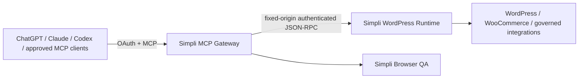

# Simpli WordPress MCP

First-party MCP control plane for Simpli Cosmetics Kenya.

The **public gateway source** has no direct Novamira or Novamira Pro endpoint/package dependency. Full WordPress-backend independence is a later acceptance gate and is **not yet claimed**.

## Current architecture



The public MCP/OAuth surface is owned by Simpli. WordPress is a bounded execution backend, not the public authorization server.

The gateway currently calls the Simpli-owned WordPress backend at:

```text
/wp-json/simpli-mcp/v1/mcp
```

using MCP-style `tools/list` and `tools/call` JSON-RPC operations. The WordPress origin is fixed in configuration and cannot be selected by an MCP caller.

## v3 migration status

The v3 program is staged so production remains recoverable while the gateway becomes independently governed.

### Phase 1 — foundation

`v3-foundation-novamira-free` established:

- one canonical runtime release identity across MCP metadata, `/`, `/health`, `/ready`, logs, and `/version`;
- a gateway-source regression check preventing direct Novamira endpoint/package dependencies in `src/`;
- first-party architecture, security, acceptance and migration records;
- explicit evidence grading: gateway independence is proven while WordPress-backend independence remains unverified.

### Phase 2 — protocol modernization

`v3-protocol-mcp-v2` moved the gateway to the stable MCP TypeScript SDK v2 split packages:

```text
@modelcontextprotocol/server 2.0.0
@modelcontextprotocol/express 2.0.0
@modelcontextprotocol/node 2.0.0
```

The public HTTP MCP endpoint uses `createMcpHandler` per request rather than an in-memory server-side MCP session map. It explicitly supports the 2026-07-28 protocol path while retaining the SDK's stateless legacy fallback for older 2025-era clients.

The protocol test suite covers both paths, including:

- 2026-07-28 `server/discover` with the required per-request `_meta` envelope and MCP standard headers;
- 2026-07-28 `tools/list` without `Mcp-Session-Id`;
- stateless legacy `tools/list` fallback;
- OAuth bearer access into the stateless MCP endpoint;
- the restricted WhatsApp credential;
- existing governed dispatcher/write guards.

### Phase 3 — durable OAuth state

`v3-oauth-durable` replaces self-contained shared-secret OAuth grants and process-memory replay state with durable opaque-token state:

- Node 24 runtime with built-in SQLite;
- persistent clients, authorization-code state, access-token state, refresh-token families and revocations;
- raw authorization codes/access tokens/refresh tokens are never stored — only SHA-256 hashes are persisted;
- authorization-code replay prevention survives process restart;
- refresh tokens rotate on every successful refresh;
- reuse of a rotated refresh token revokes the entire token family;
- access-token and client revocation take effect durably;
- omitted OAuth scope defaults to `wordpress:read`;
- production requires an absolute persistent `OAUTH_STATE_DB_PATH`;
- `/ready` includes OAuth state health.

Because the authorization server and MCP resource server are co-located, opaque high-entropy bearer tokens are intentionally used instead of adding JWT/JWKS/key-rotation machinery that would not improve the current trust boundary. Distributed token signing can be added later only if the authorization and resource servers are separated or another verified requirement justifies it.

This phase changes the gateway security model only. It does **not** prove real-client production acceptance, WordPress-backend independence, or Novamira retirement.

## Release identity

`src/version.ts` is the canonical runtime release identity. The same version must be reported by:

- MCP server metadata;
- `GET /`;
- `GET /health`;
- `GET /ready` under `release`;
- `GET /version`.

Optional deployment metadata can be injected with:

```text
SIMPLI_MCP_RELEASE_ID
SIMPLI_MCP_GIT_SHA
SIMPLI_MCP_BUILD_TIMESTAMP
```

`GET /version` is intentionally `Cache-Control: no-store` so operators can verify the currently running release.

The metadata distinguishes what is proven from what is not:

```text
novamiraGatewayDependency: false
wordpressBackendIndependence: "unverified"
```

The second value must not be promoted until the backend passes the Novamira-disabled acceptance suite.

## Authentication and authorization

The current v3 OAuth path uses Authorization Code + PKCE with durable opaque tokens. OAuth scope controls broad client access; business/execution authority is a separate layer and must not be inferred from tool access.

Current broad scopes are:

| Scope | Purpose |
| --- | --- |
| `wordpress:read` | Read-only governed operations |
| `wordpress:write` | Normal bounded writes |
| `wordpress:dangerous` | High-impact compatibility operations requiring additional controls |

If the client omits `scope`, only `wordpress:read` is granted.

The next security tranche is the **signed WordPress execution contract**: replace broad backend credential trust with exact signed execution envelopes, one-use nonces, idempotency, expected-before-state and mandatory read-back verification.

The v3 migration will progressively replace coarse dangerous access with exact Simpli authority classes and one-use execution permits. A6/irreversible or forbidden operations remain unavailable through normal MCP execution.

## Capability model

The preferred stable public primitives are:

```text
simpli_catalog
simpli_describe
simpli_execute
```

Domain capabilities live behind the Simpli-owned backend. The final v3 state requires explicit admission; backend admission is not treated as proven until the backend registry is independently tested. Legacy aliases may be retained temporarily for compatibility, but they must route to governed Simpli equivalents and must not reintroduce a third-party runtime dependency.

Representative domains include:

- WordPress content and media;
- WooCommerce products, variations, inventory and orders;
- Rank Math / SEO;
- storefront-owned components;
- shipping and POS bridges;
- forms;
- performance and maintenance;
- Browser QA and acceptance checks.

## Safety rules

- Read current state before writes.
- Tool visibility is not business authority.
- Reject writes when required authority, confirmation, before-state, schema or idempotency conditions are missing.
- Do not blindly retry an unknown write outcome; read current state first.
- Verify material writes by read-back before reporting completion.
- Keep output bounded and never log credentials or bearer tokens.
- Reject redirects from the fixed WordPress origin.
- Fail closed when policy/catalog/OAuth state readiness is not proven.

## Health and diagnostics

| Endpoint | Meaning |
| --- | --- |
| `/health` | Process liveness and canonical runtime release identity |
| `/ready` | WordPress backend/catalog readiness plus OAuth-state health and canonical release identity |
| `/version` | Runtime deployment/release metadata and current independence evidence state |
| `/.well-known/oauth-protected-resource` | OAuth protected-resource discovery |
| `/.well-known/oauth-authorization-server` | Authorization-server metadata |
| `/oauth/revoke` | OAuth token revocation |
| `/mcp` | Dual-era per-request MCP endpoint |

A successful `/health` response alone does **not** prove OAuth persistence, WordPress execution readiness, backend independence, or real-client production acceptance.

## Local verification

Requirements: Node.js 24.

```bash
npm ci
npm run check
npm test
npm run build
```

The test suite includes:

- direct Novamira gateway-dependency regression checks;
- canonical release/readiness metadata checks;
- 2026-07-28 and stateless legacy MCP protocol checks;
- OAuth PKCE, authorization-code replay, refresh rotation/reuse containment and revocation tests;
- restart-persistence tests using a real temporary SQLite database.

## Deployment safety

Production must not be switched from the current known-good release merely because an isolated branch builds.

Before a v3 cutover:

1. all applicable CI checks pass on the exact release head;
2. OAuth discovery and PKCE pass with real target clients;
3. the modern 2026-07-28 MCP path passes real-client acceptance where the client supports it;
4. the production OAuth database resides on verified persistent storage and restore/recovery has been tested;
5. `/ready` proves both OAuth state and the Simpli backend catalog are available;
6. representative reads match production truth;
7. a representative safe write passes read-before-write and read-back verification;
8. rollback is tested;
9. Novamira can be disabled without changing Simpli MCP readiness or tool availability required for the accepted scope.

See [docs/ACCEPTANCE.md](docs/ACCEPTANCE.md), [docs/ARCHITECTURE_V3.md](docs/ARCHITECTURE_V3.md), and [docs/V3_MIGRATION.md](docs/V3_MIGRATION.md).

## Rollback

Until final cutover, v3 work remains isolated from production. Rollback is a release/DNS/service decision, not a destructive WordPress migration.

Do not remove legacy plugins until the accepted v3 capability set is independently verified and an observation period has passed.
