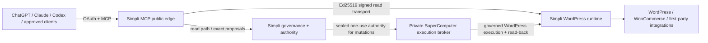

# Simpli WordPress MCP

First-party MCP control plane for Simpli Cosmetics Kenya.

The public gateway source has **no direct Novamira or Novamira Pro route/package dependency**. Full WordPress-backend independence is still **unverified** and must not be claimed until the Novamira-disabled acceptance suite passes.

## Target architecture



WordPress is a bounded execution backend, not the public OAuth/MCP server. External client identity, machine transport identity and business execution authority are deliberately separate controls.

The fixed first-party WordPress route is:

```text
/wp-json/simpli-mcp/v1/mcp
```

## Migration chain

```text
v3-foundation-novamira-free
  -> v3-protocol-mcp-v2
  -> v3-oauth-durable
  -> v3-signed-wordpress-runtime
  -> v3-authority-gate-fail-closed
  -> v3-backend-edge-compat
```

Production is not changed merely because an isolated branch builds.

### Phase 1 — first-party foundation

Established canonical release identity, first-party architecture/acceptance/security records and a regression gate preventing direct Novamira gateway dependency.

### Phase 2 — MCP protocol modernization

Moved to stable MCP TypeScript SDK v2 packages with explicit 2026-07-28 support and a stateless legacy fallback. The public HTTP path no longer depends on an in-memory MCP session map.

### Phase 3 — durable OAuth

Uses Node 24 + SQLite with high-entropy opaque bearer values whose raw tokens are not persisted. The state layer provides durable authorization-code replay protection, rotating refresh tokens, refresh-family reuse containment and durable client/token revocation.

Because authorization and resource servers are currently co-located, opaque tokens are intentionally preferred over unnecessary JWT/JWKS complexity.

### Phase 4A/B — signed WordPress transport

`simpli-wp-request-v1` uses Ed25519 to bind:

```text
HTTP method
fixed route
WordPress audience/origin
key ID
issued-at / expires-at
one-use nonce
exact body SHA-256
Simpli MCP release ID
```

The WordPress verifier supports `disabled -> observe -> enforce`, durable nonce replay rejection and overlapping admitted public keys for rotation. The gateway supports `basic -> dual -> signed` so the WordPress Application Password is not revoked before signed-only acceptance.

A valid signature proves admitted machine identity, integrity, freshness and replay status. It does **not** grant business mutation authority.

### Phase 4C — fail-closed semantic authority gate

The public gateway currently has execution ceiling:

```text
A2_PROPOSE
```

Direct behavior is intentionally:

```text
wordpress:read       -> may execute on the direct first-party read path
wordpress:write      -> BLOCKED_UNTIL_AUTHORITY_BRIDGE
wordpress:dangerous  -> BLOCKED_UNTIL_AUTHORITY_BRIDGE
```

Mutation tools are omitted from public `tools/list` and are also blocked before WordPress forwarding if a caller invokes them directly. Caller-supplied `authority_ref`, `_confirm` or similar values cannot manufacture authority.

Read-only inspection of the SuperComputer confirms an existing private sealed WordPress authority/execution relay already exists. It obtains one-use authority internally, does not expose signatures to callers, binds exact object/before-state/idempotency/approval policy, and keeps A6 blocked. The public gateway should integrate with that private authority path rather than create a second permit issuer.

### Phase 4D — hosting-edge compatible backend transport

The rc.6 branch hardens the Simpli gateway-to-WordPress hop:

- `WORDPRESS_URL` must be the exact canonical **origin**, with no path/query/fragment;
- redirects are rejected rather than silently followed;
- upstream User-Agent is browser-compatible/configurable for shared-hosting compatibility;
- truthful Simpli identity is carried separately in `X-Simpli-Client` and release metadata;
- User-Agent remains only a compatibility signal — Ed25519 remains the machine trust mechanism;
- readiness reports exact backend origin, redirect policy and User-Agent posture.

This avoids making generic AI/server User-Agent acceptance part of the security model while preserving a strict signed request path.

## Current candidate identity

```text
version       3.0.0-rc.6
architecture  v3-backend-edge-compat
```

Important release metadata includes:

```text
novamiraGatewayDependency: false
wordpressBackendIndependence: "unverified"
publicGatewayExecutionCeiling: "A2_PROPOSE"
mutationAuthoritySource: "supercomputer-sealed-permit"
mutationExecutionState: "BLOCKED_UNTIL_AUTHORITY_BRIDGE"
wordpressOriginPolicy: "exact-origin-no-redirect"
wordpressUserAgentPosture: "browser-compatible-configurable"
```

## Authentication and authority

OAuth controls broad client access. Current compatibility scopes are:

| Scope | Purpose |
| --- | --- |
| `wordpress:read` | Read-only governed access |
| `wordpress:write` | Future bounded mutation access once the authority bridge is accepted |
| `wordpress:dangerous` | Future high-impact access requiring additional exact authority |

If `scope` is omitted, only `wordpress:read` is granted.

The intended mutation path is:

```text
OAuth identity/scope
-> governance decision
-> exact sealed authority / one-use permit
-> signed machine transport
-> WordPress capability policy
-> expected-before-state + idempotency
-> mutation
-> authoritative read-back
-> audit evidence
```

A6 remains blocked regardless of OAuth scope or transport identity.

## Public capability model

The preferred stable public primitives are:

```text
simpli_catalog
simpli_describe
simpli_execute
```

Domain abilities stay behind a first-party admitted registry. Installing an unrelated plugin must not automatically create a privileged MCP tool.

Normal production MCP must not expose arbitrary PHP, arbitrary WP-CLI, generic shell/root execution, temporary administrator-login creation or unrestricted filesystem mutation.

## Health and diagnostics

| Endpoint | Meaning |
| --- | --- |
| `/health` | Process liveness + canonical release identity |
| `/ready` | OAuth state + WordPress read readiness; separately exposes write readiness |
| `/version` | Canonical release, authority and transport posture |
| `/.well-known/oauth-protected-resource` | OAuth protected-resource metadata |
| `/.well-known/oauth-authorization-server` | Authorization-server metadata |
| `/oauth/revoke` | OAuth token revocation |
| `/mcp` | Per-request MCP endpoint |

A healthy `/health` does not prove WordPress readiness. A healthy read path does not prove write readiness.

## Local verification

Requirements: Node.js 24. Cross-language signed-transport CI also uses PHP 8.2+ with libsodium.

```bash
npm ci
npm run check
npm test
npm run build
```

CI additionally verifies PHP syntax, Node-to-PHP Ed25519 interoperability, tamper rejection, authority-gate regressions, WhatsApp compatibility and a Node 24 container build.

## Current live blocker

The live SuperComputer clean-room WordPress gateway still reports:

```text
upstream_contract   UNAVAILABLE
ability_catalog     UNAVAILABLE
read_plane_ready    false
write_plane_ready   false
```

Authority issuer/crypto/ledger and the machine-attestation bridge are ready, but production execution remains correctly fail-closed. The current upstream/catalog cause is not yet proven to be only cPGuard; canonical-host routing, deployed WordPress runtime state and hosting-edge behavior still require direct acceptance evidence.

## Deployment safety

Before production cutover:

1. exact-head CI must be green;
2. OAuth + real client acceptance must pass;
3. the exact canonical WordPress origin must serve the first-party route without redirect;
4. `tools/list` and representative reads must pass through the real hosting edge;
5. signed transport must progress through `dual+observe` and `dual+enforce` before signed-only mode;
6. the public gateway must use the real private SuperComputer authority/execution bridge for mutations;
7. one bounded authorized write must pass before-state/idempotency/read-back and rollback acceptance;
8. Novamira must be disabled with the complete accepted workflow set still healthy;
9. only then may backend independence be promoted and legacy plugins enter the retirement observation window.

See `docs/ACCEPTANCE.md`, `docs/ARCHITECTURE_V3.md`, `docs/V3_MIGRATION.md`, `docs/PHASE4_SIGNED_RUNTIME.md`, `docs/PHASE4C_AUTHORITY_GATE.md`, and `docs/PHASE4D_BACKEND_EDGE_COMPAT.md`.
