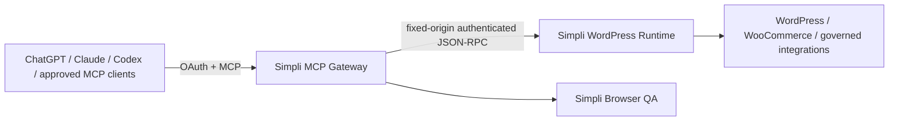

# Simpli WordPress MCP

First-party MCP control plane for Simpli Cosmetics Kenya.

The gateway exposes only Simpli-owned, explicitly admitted WordPress capabilities through OAuth-protected MCP. It does **not** depend on Novamira or Novamira Pro at runtime.

## Current architecture



The public MCP/OAuth surface is owned by Simpli. WordPress is a bounded execution backend, not the public authorization server.

The gateway currently calls the Simpli-owned WordPress backend at:

```text
/wp-json/simpli-mcp/v1/mcp
```

using MCP-style `tools/list` and `tools/call` JSON-RPC operations. The WordPress origin is fixed in configuration and cannot be selected by an MCP caller.

## v3 foundation objective

The `v3-foundation-novamira-free` line exists to complete the clean-room migration to a stable, independently governed Simpli MCP control plane.

The foundation requires:

- one canonical release identity across MCP metadata, `/`, `/health`, `/ready`, logs, and `/version`;
- no Novamira endpoint or package dependency in `src/`;
- explicit capability admission rather than automatic exposure of every installed WordPress ability;
- OAuth and MCP transport owned outside WordPress;
- deterministic authority checks for writes;
- read-before-write, idempotency, read-back verification, and rollback evidence for material mutations;
- fail-closed readiness when the WordPress backend or policy state is unavailable;
- no arbitrary PHP execution, arbitrary WP-CLI, temporary administrator links, or unrestricted filesystem mutation on the normal MCP surface.

## Release identity

`src/version.ts` is the canonical application release identity. The same version must be reported by:

- MCP server metadata;
- `GET /`;
- `GET /health`;
- `GET /ready` under `release`;
- `GET /version`.

Optional deployment metadata can be injected with:

```text
SIMPLI_MCP_RELEASE_ID
SIMPLI_MCP_GIT_SHA
SIMPLI_MCP_BUILD_TIMESTAMP
```

`GET /version` is intentionally `Cache-Control: no-store` so operators can verify the currently running release.

## Authentication and authorization

The current compatibility line supports OAuth Authorization Code + PKCE and bounded static credentials for specific machine clients. OAuth scope controls broad client access; business/execution authority is a separate layer and must not be inferred from tool access.

Current broad scopes are:

| Scope | Purpose |
| --- | --- |
| `wordpress:read` | Read-only governed operations |
| `wordpress:write` | Normal bounded writes |
| `wordpress:dangerous` | High-impact compatibility operations requiring additional controls |

The v3 migration will progressively replace coarse dangerous access with exact Simpli authority classes and one-use execution permits. A6/irreversible or forbidden operations remain unavailable through normal MCP execution.

## Capability model

The preferred stable public primitives are:

```text
simpli_catalog
simpli_describe
simpli_execute
```

Domain capabilities live behind the Simpli-owned backend and are admitted deliberately. Legacy aliases may be retained temporarily for compatibility, but they route to governed Simpli equivalents and must not reintroduce a third-party runtime dependency.

Representative domains include:

- WordPress content and media;
- WooCommerce products, variations, inventory and orders;
- Rank Math / SEO;
- storefront-owned components;
- shipping and POS bridges;
- forms;
- performance and maintenance;
- Browser QA and acceptance checks.

## Safety rules

- Read current state before writes.
- Tool visibility is not business authority.
- Reject writes when required authority, confirmation, before-state, schema or idempotency conditions are missing.
- Do not blindly retry an unknown write outcome; read current state first.
- Verify material writes by read-back before reporting completion.
- Keep output bounded and never log credentials or bearer tokens.
- Reject redirects from the fixed WordPress origin.
- Fail closed when policy/catalog readiness is not proven.

## Health and diagnostics

| Endpoint | Meaning |
| --- | --- |
| `/health` | Process liveness and canonical release identity |
| `/ready` | WordPress backend/catalog readiness plus canonical release identity |
| `/version` | Immutable deployment/release metadata |
| `/.well-known/oauth-protected-resource` | OAuth protected-resource discovery |
| `/.well-known/oauth-authorization-server` | Authorization-server metadata |
| `/mcp` | MCP endpoint |

A successful `/health` response alone does **not** prove WordPress execution readiness.

## Local verification

Requirements: Node.js 22 or later.

```bash
npm ci
npm run check
npm test
npm run build
```

The test suite includes a regression check that prevents Novamira endpoint/package dependencies from being introduced into `src/`.

## Deployment safety

Production must not be switched from the current known-good release merely because this branch builds.

Before a v3 cutover:

1. all CI checks pass;
2. OAuth discovery and PKCE pass with real target clients;
3. `/ready` proves the Simpli backend catalog is available;
4. representative reads match production truth;
5. a representative safe write passes read-before-write and read-back verification;
6. rollback is tested;
7. Novamira can be disabled without changing Simpli MCP readiness or tool availability required for the accepted scope.

See [docs/ACCEPTANCE.md](docs/ACCEPTANCE.md) and [docs/V3_MIGRATION.md](docs/V3_MIGRATION.md).

## Rollback

Until final cutover, v3 work remains isolated from production. Rollback is a release/DNS/service decision, not a destructive WordPress migration.

Do not remove legacy plugins until the accepted v3 capability set is independently verified and an observation period has passed.
